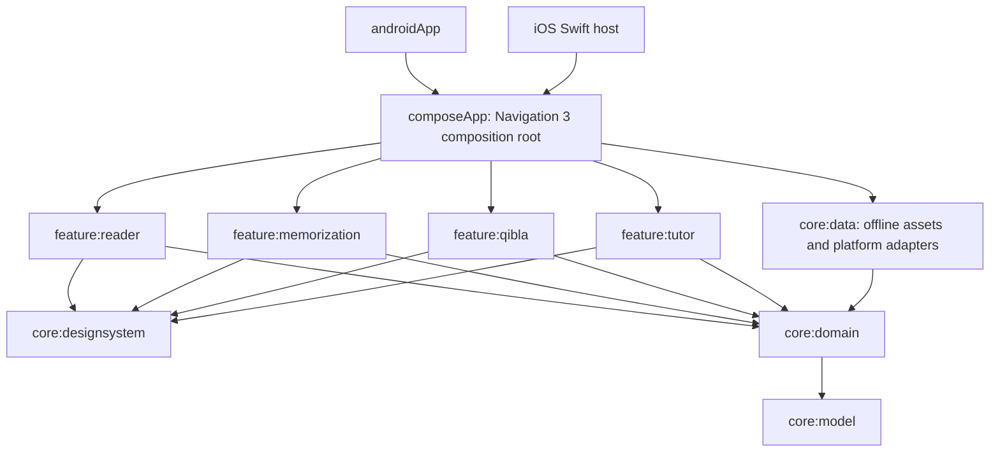

# Quran KMP architecture

Android and iOS share Compose screens, immutable verse identities, offline text, study progress contracts, repetition logic and Qibla mathematics. Platform adapters own media players, file selection, native compass readings and local settings. Android uses a service-owned Media3 ExoPlayer and MediaSession with a MediaController adapter; iOS uses AVAudioPlayer with a retained Objective-C delegate and an active playback audio session. Android backup extraction rules exclude study settings from cloud backup and device transfer. Feature modules depend on domain contracts and the shared design system; the composition root injects concrete data adapters. Domain has no Compose, Android or networking imports.

`VerseId` checks Hafs/Madani chapter and verse bounds. The canonical 114 chapter counts total 6,236 and match the bundled Tanzil metadata. Source Arabic must remain unchanged. Interface localization and Quran translations are separate capabilities; an English interface must not imply an available English translation.

`RepeatSession` counts completed recitations. N means N total playbacks. Until-memorized mode holds the current verse until the learner explicitly confirms memorization. An audio completion advances the state; a play click does not. The feature presentation controller invalidates pending callbacks with a generation token when paused, reset or disposed. It stops playback when memorization is confirmed and rejects manual double-counting while playing. Fixed-count completion still permits a separate memorization assessment. Memorized progress is an explicit learner assertion, not an automatic consequence of listening.

`QiblaCalculator` calculates the initial great-circle bearing from true north to the Kaaba at 21.4225, 39.8262. It rejects invalid coordinates and returns no direction at the Kaaba and its antipode. Manual coordinates are usable without device permissions. The Android native adapter reads rotation-vector sensors, adjusts display orientation and applies `GeomagneticField` declination using the supplied coordinates. The iOS adapter reads Core Location true heading after optional when-in-use location access. Both suppress unreliable readings; the shared screen stops sensors when backgrounded or disposed and preserves manual calculation when sensors or permission are unavailable. Physical-device calibration and direction accuracy still require hardware verification.

`StudyProgress` stores last-read verse, bookmarks, memorized verses, language and child mode. Data adapters must tolerate malformed local values and persist valid canonical verse identities. Child mode is a local family learning preference. Parent authentication and account enforcement require a separate future implementation.

AI integration is deferred at the user's request. `TutorGateway` is a future boundary. Offline learning must not present itself as generated AI or scholarly tafsir. A later implementation needs server-owned verified retrieval, citations, source review and server-only provider credentials.

## Navigation and build versions

Use Navigation 3 in common Compose code, with serializable destination keys registered for Android and iOS. Shared back-stack state is owned by the composition root; feature modules expose screen functions and events. Do not wrap legacy Activities as cross-platform destinations.

Versions selected for this implementation: Kotlin 2.3.20, Compose Multiplatform 1.11.1, Android Gradle Plugin 8.11.1 and Gradle 8.13. Navigation 3 dependency is `org.jetbrains.androidx.navigation3:navigation3-ui:1.1.1`. Kotlin and the Compose compiler plugin must have the same version. Compilation and QA reports determine what was actually verified locally.

Official sources:

- [Kotlin Gradle compatibility](https://kotlinlang.org/docs/gradle-configure-project.html)
- [Compose compatibility](https://kotlinlang.org/docs/multiplatform/compose-compatibility-and-versioning.html)
- [Navigation 3 for Compose Multiplatform](https://kotlinlang.org/docs/multiplatform/compose-navigation-3.html)
- [AGP 8.11 and Gradle 8.13 requirements](https://developer.android.com/build/releases/agp-8-11-0-release-notes)
